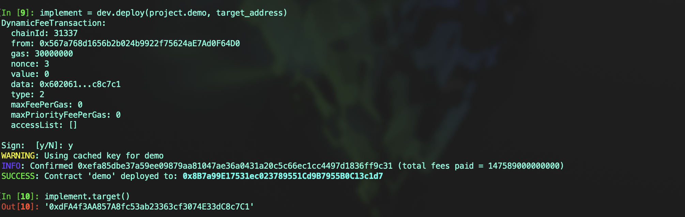
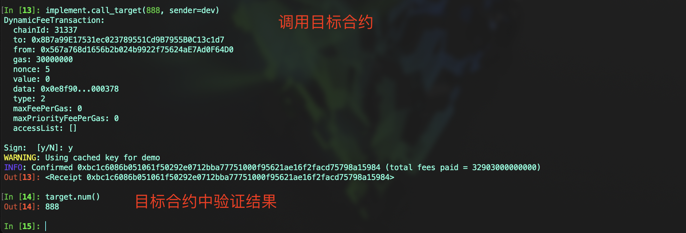

# Vyper 入门: 17.调用其他合约
在Vyper中，调用其他合约可以通过接口和 `raw_call` 两种方式实现，本节中我们主要介绍如何使用接口调用其他合约，使用接口调用其他合约是一种常见的实践，它允许合约之间进行互操作和通信


## 部署目标合约
首先，我们需要一个目标合约。以下示例中，合约包含一个状态变量 `num` 和一个在 `num` 修改时触发的事件 `SetNum`

建议在定义公共接口时使用清晰易懂的接口名和参数名，并明确指定返回类型

```
# @version 0.3.9

event SetNum:
    _old_num: indexed(uint256)
    _new_num: indexed(uint256)

num: public(uint256)


@external
def set_num(_new_num: uint256) -> bool:
    old_num: uint256 = self.num
    self.num = _new_num

    log SetNum(old_num, _new_num)
    return True
```


## 调用目标合约
使用关键字 `interface` 声明接口以调用目标合约，关于接口的详细介绍可以返回第13节中查看

- 注意：确保外部合约地址和方法是可信的，以避免调用恶意合约
- 在调用外部合约时，应考虑可能的执行失败，通过返回值或其他机制处理调用失败的情况

示例代码:

```
# @version 0.3.9

interface TargetContract:
    def num() -> uint256: view
    def set_num(_new_num: uint256) -> bool: nonpayable


target: public(address)


@external
def __init__(_target: address):
    self.target = _target


@view
@external
def get_num() -> uint256:
    return TargetContract(self.target).num()


@external
def call_target(_new_num: uint256):
    success: bool = TargetContract(self.target).set_num(_new_num)
    assert success, "call fail"
```

### 调用流程

#### 1. **部署目标合约和调用者合约**，在调用者合约的构造函数中传入目标合约的地址



#### 2. 在调用者合约中调用目标合约的 `set_num`，验证调用成功


#### 3. 在目标合约中验证状态变更，确保调用已生效



## 总结
本节介绍了如何在Vyper中使用接口调用其他已知合约。对于更复杂的接口情况，可能需要考虑使用 `raw_call`，这将在下一节中详细讨论。