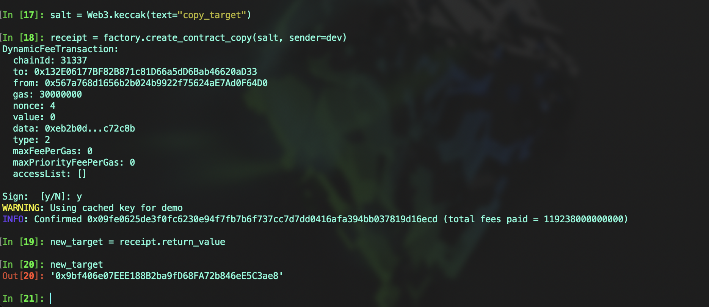
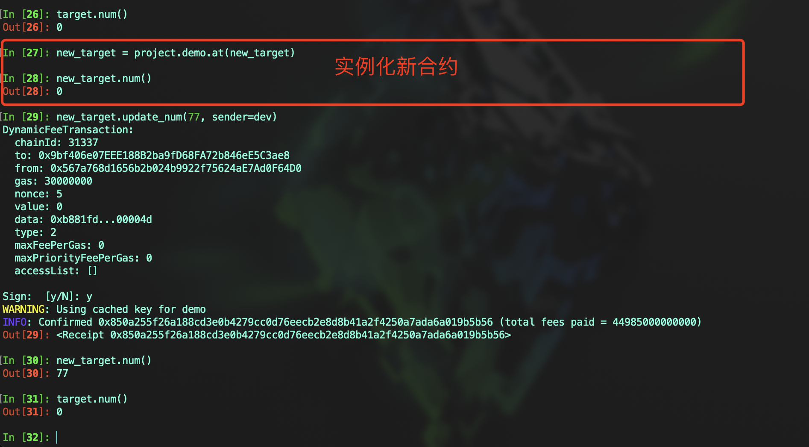

# Vyper 入门: 20. create_copy_of

在 `Vyper` 中，`create_copy_of` 用于创建一个已存在合约的副本。这个副本将拥有原始合约的完整代码，但会有一个全新的、独立的状态存储。这种方法适合于需要多个具有相同行为但独立状态的合约实例的场景。

## 特点和区别

1. **独立的状态存储:** 使用 `create_copy_of` 创建的合约副本与原始合约共享相同的代码，但它们的状态是独立的。这意味着改变一个合约的状态不会影响到其他副本
2. **部署成本:** 由于 `create_copy_of` 复制了整个合约代码，因此这可能比使用最小化代理合约（如 `create_minimal_proxy_to` 创建的合约）的部署成本要高
3. **合约升级:** 虽然 `create_copy_of` 创建的合约副本拥有相同的代码，但它们不适用于升级模式，因为每个副本的代码都是固定的。合约如果需要升级，建议使用 `create_minimal_proxy_to` 部署代理合约
4. **应用场景:**
   - 需要多个合约实例，每个实例都具有相同的功能但拥有独立的数据时
   - 常见的用例包括多个独立的投票合约、游戏合约或任何需要多个相同逻辑但独立状态的场景

## 语法

```
create_copy_of(_target: address, _value: uint256 = 0, _salt: bytes32) -> address
```

- `_target`: 要复制的合约地址
- `_value`: 可选， 发送到新合约的 ETH，默认为 0
- `_salt`: 可选，确定 `CREATE2` 操作码使用的一个 `bytes32` 值，如果未提供，则默认使用 `CREATE` 部署代理合约。使用 `_salt` 值可以提前预估新合约地址
- **返回值:** 返回新创建的合约地址，`salt` 值如果已经使用，合约会创建失败
- **注意:** 创建合约时无法传递构造函数参数

## 部署一个原始合约

首先部署一个原始合约，包含状态变量 `num` 和记录值变更的事件 `UpdateNum`。

代码示例:

```
# @version 0.3.9


event UpdateNum:
    _old_num: indexed(uint256)
    _new_num: indexed(uint256)


num: public(uint256)


@external
def __init__():
    pass


@external
def update_num(_new_num: uint256) -> bool:
    old_num: uint256 = self.num
    self.num = _new_num
    log UpdateNum(old_num, _new_num)

    return True
```

## 部署 `Factory` 合约

使用 `create_copy_of` 在 `Factory` 合约中复制原始合约

代码示例:

```
# @version 0.3.9


event CreateNewContract:
    _new_contract: indexed(address)
    _salt: indexed(bytes32)


all_copied: public(HashMap[uint256, address])
all_copied_length: public(uint256)
target: public(address)


@external
def __init__(_target: address):
    self.target = _target


@external
def create_contract_copy(_salt: bytes32) -> address:
    new_contract: address = create_copy_of(self.target, salt=_salt)
    self.all_copied[self.all_copied_length] = new_contract
    self.all_copied_length += 1
    log CreateNewContract(new_contract, _salt)

    return new_contract
```

## 部署验证合约

1. 部署原始合约和 `factory` 合约，并使用 `create_copy_of` 复制一个合约副本
   

2. 更新新合约中 `num` 值，可以看到新合约的 `num` 值已经更新，并且原始合约的值不会改变。
   在控制台中我们使用 `ape` 开发框架中的 `project.<contractName>.at` 方法实例化新合约



3. 和 `create_minimal_proxy_to` 一样，如果使用相同的 `salt` 值部署同一个合约，那么交易会失败
   

## 总结

`create_copy_of` 提供了一种在 `Vyper` 中创建合约副本的有效方法，特别适用于需要多个独立状态但共享相同逻辑的合约场景。但需要注意，与使用代理模式相比，可能会有更高的部署成本和较少的灵活性。
