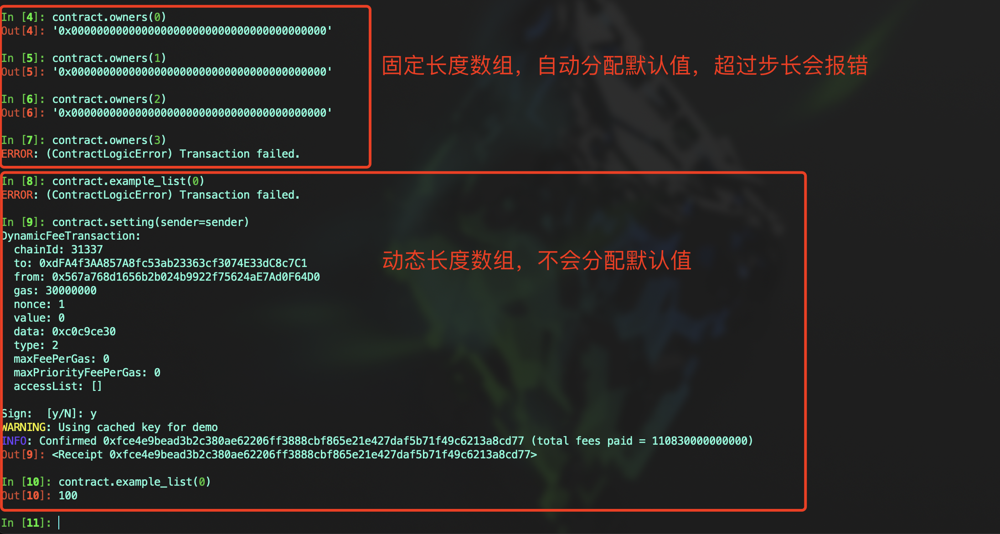

# Vyper 入门： 6. 引用类型
### 在Vyper中，引用类型是指复杂的数据类型，它们引用对象或值。与值类型不同，引用类型可以存储和操作数据结构或大量数据。Vyper中常见的引用类型有：数组(Arrays)和结构体(Structs)。
- `数组`：同一类型元素的集合，可以是固定大小或动态的
- `结构体`：自定义类型，可以组合多个变量


## 数组
#### 数组是Vyper中常用的变量类型，用来存储同一类型元素的集合，比如整数、地址、字节等。数组分为固定长度数组和动态长度数组。
- 固定长度数组：在声明时指定数组的长度，长度不可变，用于存储已知且不变数量的元素。使用`typeName[N]` 格式声明，其中N是元素数量
#### 示例代码
```
owners: address[3]
numbers: uint256[3]
bytess: bytes32[3]
```
#### 注意：如果需要声明 `Bytes[N]` 数组，需要使用关键字 `DynArray` 来创建数组

- 动态长度数组: 使用 `DynArray` 关键字创建动态数组，Vyper中的动态数组与Solidity不同，Vyper是有界数组，声明时需要指定最大数组长度。使用语法表示为 `DynArray[T, N]`，其中 `T` 是元素类型，`N` 是数组的最大长度。`DynArray` 的含义和Python中的`List` 类似，同样存在 `append` 和 `pop` 语法。

#### 示例代码
```
# 声明一个整数数组
example_list: DynArray[uint256, 3]

@external
def setting():
	# 添加整数
	self.example_list.append(100)
	self.example_list.append(200)
	self.example_list.append(300)
	
	# 移除整数
	self.example_list.pop()
```


#### 固定长度数组和动态长度数组的区别在于，固定长度数组在声明时就确定了长度，并且每个元素都会被初始化为默认值，它们在内存中占据连续的空间，数组长度在声明时确定且之后不可更改。而动态数组没有默认值，仅在添加数据时才分配存储空间，它们的长度是可变的，可以在运行时动态添加或移除元素，但有一个最大长度限制。
#### 这种区分主要体现在数组初始化和元素存储的方式上。固定长度数组更适合于事先知道数据量的场景，而动态数组更灵活，适用于数据量可能变化的情况。

### 扩展：Vyper中的默认值
- `address`: `0x0000000000000000000000000000000000000000`
- `bool`: `False`
- `bytes32`: `0x0000000000000000000000000000000000000000000000000000000000000000`
- `decimal`: `0.0`
- `uint8`: `0`
- `int128`: `0`
- `int256`: `0`
- `uint256`: `0`


## 结构体
#### 结构体允许你将多个不同类型的变量组合在一个自定义类型中。结构类型可以在映射和数组内部使用。结构可以包含数组和其他结构，但不能包含映射。

#### 代码示例
```
struct MyStruct:
    value1: uint256
    value2: decimal

# 初始化一个结构体
example_struct: public(MyStruct)

# 给结构体赋值
# 方式1: 声明一个结构体赋值
@external
def set_struct():
	self.example_struct = MyStruct({value1: 100, value2: 99.0})

# 方式2: 直接对结构体赋值
@external
def set_struct1():
	self.example_struct.value1 = 1
	self.example_struct.value2 = 2.0

```


## 总结
#### 本节中，我们介绍了 `数组` 和 `结构体` 的使用，在选择使用哪种引用类型时，考虑数据的性质和合约的需求，动态数组和固定大小列表适合存储数量可变的同类元素，结构体非常适合用于组织具有不同属性的数据。
