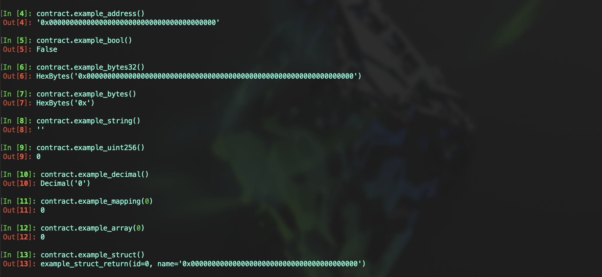

# Vyper 入门： 8. 变量初始值
### Vyper的初始值为变量在创建时赋予的默认值，它确保了变量在使用前有一个已知和预期的状态。

### Vyper中的值类型默认值
- `address`: `0x0000000000000000000000000000000000000000`
- `bool`: `False`
- `bytes32`: `0x0000000000000000000000000000000000000000000000000000000000000000`
- `Bytes[N]`: `0x`
- `String[N]`: `""`
- `decimal`: `0.0`
- `uint8`: `0`
- `int128`: `0`
- `int256`: `0`
- `uint256`: `0`

#### 示例代码
```
example_address: public(address)
example_bool: public(bool)
example_bytes32: public(bytes32)
example_bytes: public(Bytes[255])
example_string: public(String[255])
example_uint256: public(uint256)
example_decimal: public(decimal)
```

### 引用类型默认值
- `映射`：所有元素为其类型的默认值
- `结构`： 所有元素为其类型的默认值
- `数组`：
	- 固定长度数组：所有元素为其类型的默认值
	- 动态数组：空数组 `[]`

#### 示例代码
```
example_mapping: public(HashMap[uint256, uint256])

struct ExampleStruct:
	id: uint256
	name: address

example_array: public(uint256[3])
example_dynarray: public(DynArray[uint256, 3])
```




## 总结
#### 本节中，我们介绍了 Vyper 中变量的初始值。变量被声明但没有赋值的时候，它的值默认为初始值。