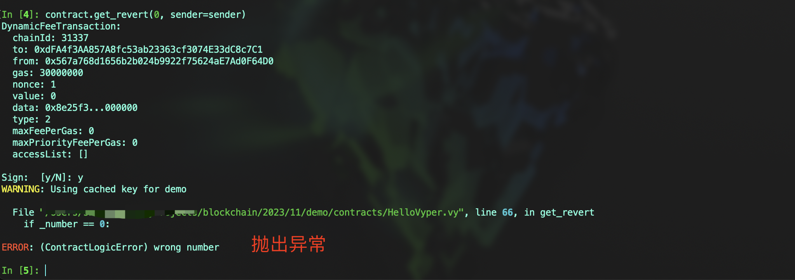

# Vyper 入门： 14. 异常
### Vyper使用状态回退异常来处理错误。当异常发生时，会触发REVERT操作码（0xFD），并将提供的原因作为错误信息。异常导致合约代码停止执行，合约状态回退到交易发生前的状态，剩余的gas被返回给交易发送者。
### 在合约编写的过程中，我们常需要使用到异常帮助我们 `DEBUG`，与Solidity不同的是，Vyper使用断言（assert）和异常（raise）来处理错误

## 1. raise 
#### 使用raise语句触发一个异常并回退当前调用，可以提供一个错误信息字符串，用于描述异常原因。

#### 示例代码
```
@external
def get_revert(_number: uint256):
	if _number == 0:
		raise "wrong number"
```



#### 错误字符串不是必需的，但如果提供，其长度限制为 `1024` 字节

## 2. assert
#### `assert` 用于对特定条件进行断言。如果条件判断为假，则交易被回退。与Python中的断言一致，用于确保程序运行中的关键条件满足

#### 示例代码
```
@external
def check_assert(_number: uint256):
	assert _number != 0, "wrong number"


# 等同于
@external
def check_assert(_number: uint256):
	if _number == 0:
		raise "wrong number"
```


#### 与 `raise` 一样，如果提供错误字符串，其长度限制为 `1024` 字节

## 其他注意事项
- 如果在子调用中发生异常，它会自动“冒泡上来”（即，异常被重新抛出），这意味着，即使是嵌套调用中的错误，也能被捕获并处理。
- 避免使用 `INVALID` 操作码，如果错误字符串被设置为 `UNREACHABLE`，将使用 `INVALID` 操作码`（0xFE）`而非 `REVERT`。这种情况下，回退的调用不会收到gas退款。

#### 示例代码
```
@external
def get_invalid(_number: uint256):
	if _number == 0:
		raise "UNREACHABLE"
```
#### `INVALID` 操作码通常表示代码中存在严重问题，因此除非有特殊原因，一般应避免在生产级合约中使用。


## 总结
#### 在本节中，我们介绍了异常、断言和 `INVALID` 操作码的使用。在合约开发中有效地处理异常和断言对合约的安全性和稳定性非常重要。
