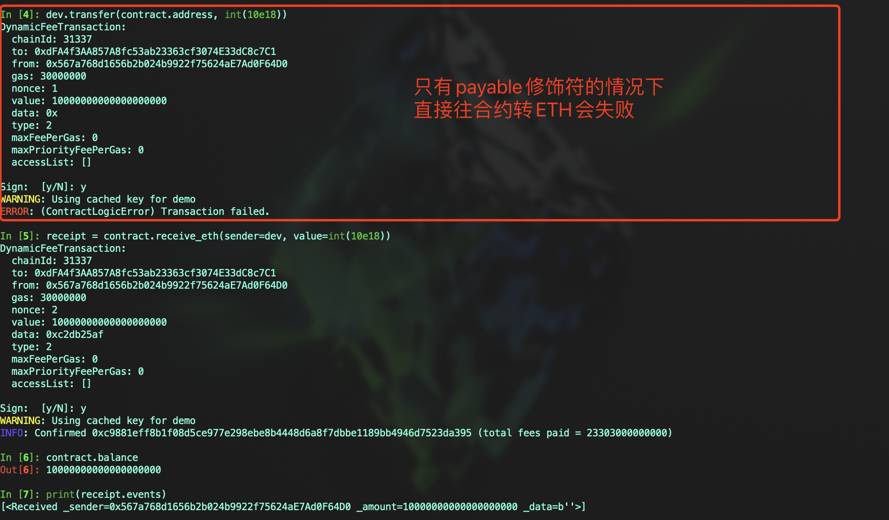

# Vyper 入门: 15. 接收ETH
Vyper中接收ETH可以分为两种情况：局部接收和全局接收。
- **局部接收**：使用 `@payable` 修饰符处理需要接收ETH的特定函数
- **全局接收**：使用 `__default__` 特殊函数，用于处理发送到合约地址的ETH，但不调用任何具体的函数


## `@payable` 修饰符
用于标记可以接收ETH的函数，在合约中，任何应该接收ETH的函数都需要使用此修饰符

代码示例：
```
event Received:
	_sender: indexed(address)
	_amount: indexed(uint256)
	_data: Bytes[1024]
	

@payable
@external
def receive_eth():
	log Received(msg.sender, msg.value, b"")
```

- **注意**：只有标记了 `@payable` 的函数才能接收ETH。无法直接向未标记的合约转账ETH





## `__default__` 函数
`__default__` 函数是一个特殊的函数，用于在未调用特定函数的情况下接收ETH，适用于接收不涉及特定逻辑的普通转账

它也常用于构建代理合约，在第11节回调函数中有代理合约的实现，感兴趣的可以返回查看

示例代码：
```
event Received:
	_sender: indexed(address)
	_amount: indexed(uint256)
	_data: Bytes[1024]


@payable
@external
def __default__():
	log Received(msg.sender, msg.value, b"")

```


## 总结
在本节中我们介绍了如何接收ETH的两种方式，通过以上教程，你可以了解在Vyper中创建和管理能够接收ETH的智能合约的基本步骤和最佳实践