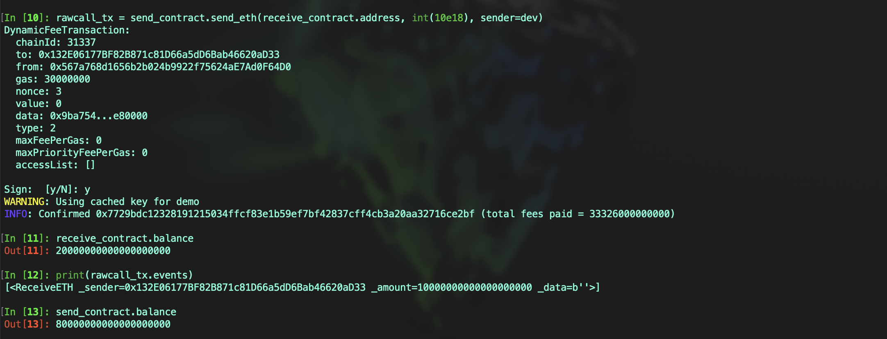
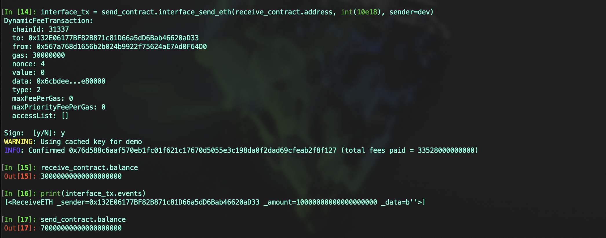

# Vyper 入门: 16. 发送 ETH

在 Vyper 中，发送以太币（ETH）可以通过几种不同的方法实现: `send`、`raw_call` 和接口发送

## 部署接收 ETH 合约

首先，我们需要一个能够接收 `ETH` 的合约。该合约声明了 `ReceiveETH` 事件以及用于接收 ETH 的函数

```
# @version 0.3.9

event ReceiveETH:
    _sender: indexed(address)
    _amount: indexed(uint256)
    _data: Bytes[max_value(uint16)]


@payable
@external
def receive_eth():
    log ReceiveETH(msg.sender, msg.value, b"")


@payable
@external
def __default__():
    log ReceiveETH(msg.sender, msg.value, b"")

```

## 使用 `send` 发送 ETH

`send` 适用于简单的 ETH 转账，不涉及复杂的逻辑或状态变更，通常不建议用于复杂的合约交互。在 `Vyper/Solidity` 合约开发时，建议尽量避免使用 `send` 来发送 ETH。

### 为什么不建议使用 `send` 发送 ETH

`send` 仅提供 `2300 Gas`，这可能不足以覆盖接收方合约中的所有操作，尤其是当接收方合约需要执行状态变更或有事件日志时。

**代码示例**:

```
@external
def send_eth(_receiver: address, _amount: uint256):
    send(_receiver, _amount)
```


## 使用 `raw_call` 发送 ETH

`raw_call` 提供了更大的灵活性和控制，并且没有 `gas` 限制，可以支持对方合约实现复杂逻辑，具体使用方法将在第 18 节中介绍，本节中仅介绍如果发送 ETH

- 使用语法 `raw_call(_receiver, b"", value=_amount)`
- 第 1 个参数代表需要调用/发送的合约/用户地址，当第二个参数为 `b""`时，代表此时 `raw_call` 的作用是发送 ETH; `value` 是转移数量，默认为 0
- `raw_call` 的返回值是 `bytes`, 需要自行转化成需要的类型

**代码示例**:

```
@external
def raw_call_eth(_receiver: address, _amount: uint256):
    response: Bytes[32] = raw_call(
        _receiver,
        b"",
        value=_amount,
        max_outsize=32
    )

    if len(response) != 0:
        assert convert(response, bool)
```

- `raw_call` 较为复杂，使用时需要更多的注意事项，以避免安全风险



## 使用接口发送 ETH

我们在第 13 节时详细介绍了接口(`interface`)的使用，通过接口发送 ETH 的前提需要目标合约接口函数声明装饰器 `@payable`，否则将发送失败

代码示例:

```
interface ReceiverInterface:
    def receive_eth(): payable


@external
def interface_send_eth(_receiver_addr: ReceiverInterface, _amount: uint256):
    _receiver_addr.receive_eth(value=_amount)

```



## 比较

- `send`：最简单，但功能有限，适用于不需要执行合约代码的简单转账
- `raw_call`：更复杂，提供更大的灵活性，推荐使用，但需要更谨慎地处理
- `interface`：可以调用接收方合约中的函数

## 注意

通过以上 3 种方式发送 `ETH` 的前提是实施合约需要有足够的余额，因为发送方是实施合约而不是合约调用者

## 总结

本节介绍了 Vyper 中发送 ETH 的三种主要方法。选择合适的方法取决于合约的具体需求和场景。建议在大多数情况下优先考虑使用 `raw_call`
