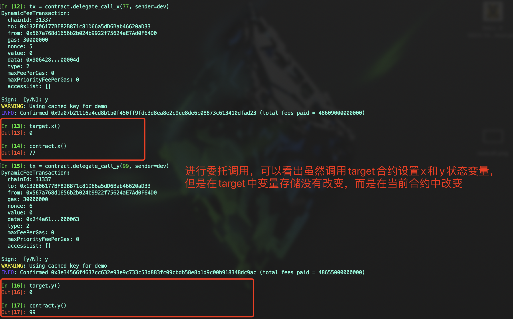

# Vyper 入门: 18. raw_call
在Vyper中，`raw_call` 是一种低级的函数调用方式，它提供了直接与以太坊虚拟机（EVM）交互的能力
- 它可以调用合约地址，并将字节字符串数据发送给该地址
- `raw_call` 的返回值是一个字节数组，表示被调用的函数的返回数据

本节中我们介绍 `raw_call` 的三种用法:
1. 普通调用: 用于执行一个普通的函数调用，可以更改合约的状态
2. 代理/委托调用: 调用另一个合约的函数，但在当前合约的上下文中执行，通过 `is_delegate_call` 参数实现
3. 静态调用: 进行只读 `view/pure` 调用，不改变合约状态，通过 `is_static_call` 参数实现

## `raw_call` 基础语法
```
raw_call(to, data, value)
```


## `raw_call` 参数详解
- `to`: 目标合约的地址
- `data`: ABI编码的函数调用数据
- `max_outsize` (可选): 调用返回的字节数组的最大长度，实际返回的数据如果超出，则只返回此长度
- `gas` (可选): 自定义 `gas`， 默认为 `msg.gas`
- `value` (可选): 随调用发送的 ETH 数量
- `is_delegate_call` (可选): 指定是否执行代理/委托调用
- `is_static_call` (可选): 指定是否执行静态调用
- `revert_on_failure` (可选): 指定是否返回调用 `success` 结果，如果为 `True`，调用失败将抛出 `revert`，默认为 `True`


## 首先部署一个目标合约
目标合约中包含两个调用函数 `test_add` 和 `test_sub` 进行数学运算，函数返回运算结果。
一个用于接收 `ETH` 的函数

代码示例:

```
# @version 0.3.9

x: public(uint256)
y: public(uint256)
sender: public(address)


@external
def test_add(_x: uint256, _y: uint256) -> uint256:
    self.sender = msg.sender

    return _x + _y


@external
def test_sub(_x: uint256, _y: uint256) -> uint256:
    self.sender = msg.sender

    return _x - _y


@external
def update_x(_x: uint256):
    self.x = _x


@external
def update_y(_y: uint256):
    self.y = _y


@payable
@external
def receive_eth():
    pass
```


## 1. 普通调用
用于发送数据到合约，并执行合约代码

代码示例:

```
# @version 0.3.9

target: public(address)
add_num: public(uint256)
sub_num: public(uint256)


@external
def __init__(_target: address):
    self.target = _target


@external
def raw_call_test_add(_x: uint256, _y: uint256):
    response: Bytes[32] = raw_call(
        self.target,
        _abi_encode(
            _x, # 第一个参数
            _y, # 第二个参数
            method_id=method_id("test_add(uint256,uint256)") # 调用的函数签名
        ),
        max_outsize=32
    )

    # 将返回的字节数组转化成整型
    self.add_num = convert(response, uint256)


@external
def raw_call_test_sub(_x: uint256, _y: uint256):
    success: bool = False
    response: Bytes[32] = b""
    success, response = raw_call(
        self.target,
        concat(
            method_id("test_sub(uint256,uint256)"), # 函数签名
            convert(_x, bytes32), # 第一个参数
            convert(_y, bytes32) # 第二个参数
        ),
        max_outsize=32,
        gas=100000,
        value=0,
        revert_on_failure=False
    )

    assert success
    self.sub_num = convert(response, uint256)
```

示例代码中对于 `data` 的构建使用了两种方式，`_abi_encode` 和 `concat`，从示例中也能看出 `_abi_encode` 的使用方式更加简单，在开发过程中根据具体情况选择使用，不过建议优先使用 `_abi_encode` 进行编码


## 2. 代理/委托调用
当合约`A`委托调用合约`B`时，`B`的代码将在合约内部执行`A`，这将更新合约内的状态变量和以太币余额`A`而不是`B`，需要注意的是，如果需要改变合约`A`中的状态变量，那么合约`B`中的声明的状态变量存储结构必须要和合约`A`一致

Vyper中实现委托调用只需要在 `raw_call` 中添加参数 `is_delegate_call=True`

示例代码:

```
x: public(uint256)
y: public(uint256)


@external
def delegate_call_x(_x: uint256):
    raw_call(
        self.target,
        _abi_encode(
            _x,
            method_id=method_id("update_x(uint256)")
        ),
        is_delegate_call=True
    )


@external
def delegate_call_y(_y: uint256):
    raw_call(
        self.target,
        _abi_encode(
            _y,
            method_id=method_id("update_y(uint256)")
        ),
        is_delegate_call=True
    )
```




代理/委托调用常用于创建可升级的代理合约

### 什么是代理合约？
**代理合约(Proxy contract)**: 将智能合约的存储合约和逻辑合约分开：代理合约存储所有相关的变量，并且保存逻辑合约的地址；所有函数存在逻辑合约（Logic Contract）里，通过delegatecall执行。当升级时，只需要将代理合约指向新的逻辑合约即可。

代理合约示例：[VyperProxy](./VyperProxy.vy)

逻辑合约示例：[Implementation](./Implementation.vy)


## 3. 静态调用
只能读取数据，不能进行状态变更，适用于查询其他合约的状态

Vyper中实现静态调用只需要在 `raw_call` 中添加参数 `is_static_call=True`

代码示例:

```
@view
@external
def get_sender() -> address:
    response: Bytes[32] = raw_call(
        self.target,
        method_id("sender()"),
        max_outsize=32,
        is_static_call=True
    )

    return extract32(response, 0, output_type=address)
```


## 总结
本节中我们介绍了 `raw_call` 的3种用法及其各个参数的含义，使用时，确保与已知和可信的合约交互