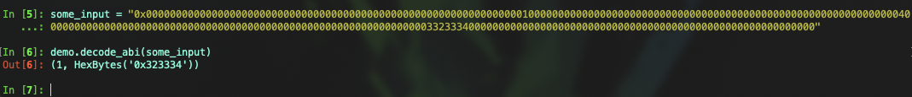

# Vyper 入门: 22. ABI编解码

`ABI`(Application Binary Interface)是应用二进制接口，是一种用于智能合约和 Ethereum 虚拟机之间数据转换的标准格式

`_abi_encode` 和 `_abi_decode` 是 `Vyper` 中的编解码函数。本节中我们讲解如何进行使用


## ABI 编码
采用可变数量的参数作为输入，并返回 `ABIv2` 编码的字节字符串。用于将参数打包到 `raw_call`、`EIP712` 以及其他需要一致且高效的序列化方法的情况，他将每个参数填充为32字节的数据，并拼接在一起

语法:

```
_abi_encode(*args, ensure_tuple: bool = True)→ Bytes[N]
```
- `*args`: 任意参数
- `ensure_tuple`: 如果设置为 `True`，则确保即使单个参数也被编码为元组。换句话说，字节被编码为 `(bytes,)`，`(bytes,)` 被编码为 `((bytes,),)` 这是 **Vyper** 和 **Solidity** 函数的调用约定。除了非常具体的用例外，这应该设置为 **True**
- `method_id`: 可选的，附加到 `abi` 编码字节字符串开头的文字十六进制或 `Bytes[4]` 值，与合约交互时使用

`_abi_encode` 返回一个字节串，其最大长度由参数确定，例如Bytes[32]长度的参数进行编码后会返回Bytes[64]长度的值

示例代码:
```
@view
@external
def foo() -> Bytes[128]:
    x: uint256 = 1
    y: Bytes[32] = b"234"
    return _abi_encode(x, y)
```


从返回的数据可以看出所有的参数都被填充 `0` 为32字节的数据

`0x0000000000000000000000000000000000000000000000000000000000000001000000000000000000000000000000000000000000000000000000000000004000000000000000000000000000000000000000000000000000000000000000033233340000000000000000000000000000000000000000000000000000000000`


**method_id**

在 `_abi_encode` 中通过添加参数 `method_id` 与合约进行交互，如果不想使用这种方式与合约交互，也可以通过 `concat` 函数手动拼接 `ABI` 数据

示例代码:

```
@view
@external
def encode_abi() -> Bytes[132]:
    x: uint256 = 1
    y: Bytes[32] = b"234"
    return _abi_encode(x, y method_id=method_id("foo()"))


# 使用 concat 拼接

@view
@external
def concat_abi() -> Bytes[132]:
    x: uint256 = 1
    y: Bytes[32] = b"234"
    return concat(
        method_id("foo()"),
        convert(x, bytes32),
        convert(y, bytes32)
    )
```


`encode_abi返回值`
`0xc29855780000000000000000000000000000000000000000000000000000000000000001000000000000000000000000000000000000000000000000000000000000004000000000000000000000000000000000000000000000000000000000000000033233340000000000000000000000000000000000000000000000000000000000`

`concat_abi返回值`
`0xc298557800000000000000000000000000000000000000000000000000000000000000013233340000000000000000000000000000000000000000000000000000000000`

从两种 ABI 编码方式可以看出，`_abi_encode` 编码更加简单便捷，使用 `concat` 更加复杂，使用 `concat` 编码会将其中很多填充的 `0` 省略，如果你想节省空间可以使用 `concat` 进行编码，但是需要更加注意参数的处理


## ABI 解码

`_abi_decode`: 将 ABI 编码的数据解码回原始数据，并根据指定的输出类型返回解码后的值

语法:
```
_abi_decode(b: Bytes, output_type: type_, unwrap_tuple: bool = True) -> Any
```

- `b`: 需要解码的字节数组
- `output_type`: 解码后输出的值类型或者输出类型元组
- `unwrap_tuple`: 如果设置为 `True`，即使只指定了一种输出类型，输入也会被解码为元组。换句话说，`_abi_decode(b, Bytes[32])` 被解码为 `(Bytes[32],)`。这是 Vyper 和 Solidity 函数生成的 ABIv2 编码值的约定。除了非常具体的用例外，这应该设置为 True

返回值根据 `output_type` 决定

示例代码：

```
@view
@external
def decode_abi(_some_input: Bytes[128]) -> (uint256, Bytes[32]):
    x: uint256 = empty(uint256)
    y: Bytes[32] = empty(Bytes[32])
    x, y = _abi_decode(_some_input, (uint256, Bytes[32]))
    return x, y
```




## 总结
本节中，我们介绍了 `_abi_encode` 和 `_abi_decode` 的使用，注意确保正确地处理数据类型，特别是当涉及到数组和复杂类型时