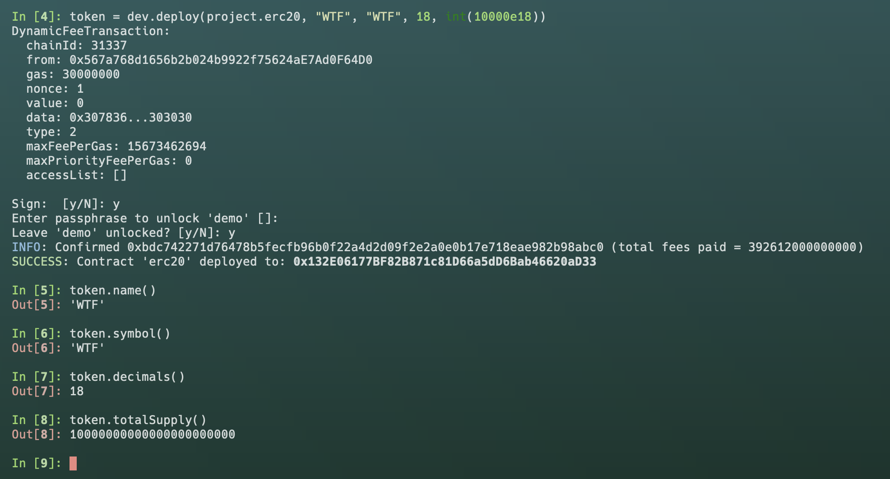
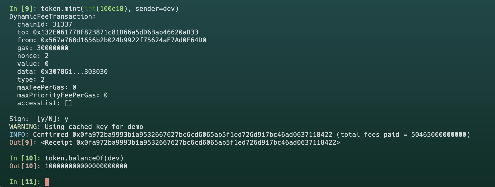
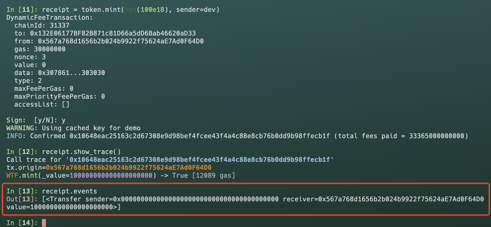

# Vyper 入门: 25. ERC20

`ERC20` 是一种代币标准，用于以太坊网络上的智能合约，以实现代币的发行和管理。它定义了一些基本的功能，如获取代币总供应量、转账、以及查看账户余额等，确保了不同代币间的互操作性。

本节中我们将简单介绍一下 `ERC20` 代币标准并部署一个测试代币

## 理解 `ERC20` 标准

`ERC20` 标准定义了一组最小的公共接口，一个 `ERC20` 代币合约必须实现这些接口和事件，包括：

### 函数接口

- `totalSupply()`: 返回代币的总供应量

```
totalSupply: public(uint256)
```

- `balanceOf(address)`: 返回账户余额

```
balanceOf: public(HashMap[address, uint256])
```

- `transfer(address, uint256)`: 转账, 从调用者地址向另一个地址转移代币

```
@external
def transfer(_to: address, _value: uint256) -> bool:
```

- `transferFrom(address, address, uint256)`: 授权转账, 允许一个地址代表另一个地址转移代币

```
@external
def transferFrom(_from: address, _to: address, _value: uint256) -> bool:
```

- `approve(address, uint256)`: 授权, 允许一个地址（受托人）代表另一个地址提取代币

```
@external
def approve(_spender: address, _value: uint256) -> bool:
```

- `allowance(address, address)`: 返回授权额度, 即一个地址（受托人）被允许从另一个地址提取的代币数量

```
allowance: public(HashMap[address, HashMap[address, uint256]])
```

### 事件接口

- `Transfer(address, address, uint256)`: 记录代币转移事件

```
event Transfer:
    sender: indexed(address)
    receiver: indexed(address)
    value: uint256
```

- `Approval(address, address, uint256)`: 记录代币授权事件

```
event Approval:
    owner: indexed(address)
    spender: indexed(address)
    value: uint256
```

## 实现 `ERC20`

现在实现一个简单 `ERC20` 代币

### 状态变量

在 `Vyper` 中，状态变量是存储在区块链上的值，代表合约的状态。对于 `ERC20` 代币，我们需要以下状态变量：

```
totalSupply: public(uint256)
balanceOf: public(HashMap[address, uint256])
allowance: public(HashMap[address, HashMap[address, uint256]])

name: public(String[32])
symbol: public(String[32])
decimals: public(uint8)
```

其中 `totalSupply`, `balanceOf` 和 `allowance` 是 `ERC20` 标准接口；`name`, `symbol` 和 `decimals` 代表代币的名称、代号和小数点

### 构造函数

构造函数是部署合约时自动调用的特殊函数。在 `ERC20` 代币合约中，我们通常在构造函数中设置总供应量、名称、代号、小数点，并将所有代币的初始余额分配给合约的部署者。

```
@payable
@external
def __init__(_name: String[32], _symbol: String[32], _decimals: uint8, _total_supply: uint256):
    self.name = _name
    self.symbol = _symbol
    self.decimals = _decimals
    self.totalSupply = _total_supply
```

### `transfer()` 函数

`ERC20` 标准必须的函数，实现代币转移逻辑：调用方扣除转移的代币数量，接收方增加数量。如果需要实现更复杂的转账逻辑，比如销毁、分红、税收等都是在这个函数中增加

```
@external
def transfer(_to: address, _value: uint256) -> bool:
    self.balanceOf[msg.sender] -= _value
    self.balanceOf[_to] += _value
    log Transfer(msg.sender, _to, _value)
    return True
```

### `transferFrom()` 函数

`ERC20` 标准必须的函数，实现授权转移逻辑：授权一个地址代表另一个地址转移代币

```
@external
def transferFrom(_from: address, _to: address, _value: uint256) -> bool:
    self.balanceOf[_from] -= _value
    self.balanceOf[_to] += _value
    self.allowance[_from][msg.sender] -= _value
    log Transfer(_from, _to, _value)
    return True
```

### `approve()` 函数

`ERC20` 标准必须的函数，实现授权逻辑，允许一个地址（受托人）代表另一个地址提取代币，受托人可以是 `EOA` 地址，也可以是合约地址

```
@external
def approve(_spender: address, _value: uint256) -> bool:
    self.allowance[msg.sender][_spender] = _value
    log Approval(msg.sender, _spender, _value)
    return True
```

### `mint()` 函数

实现代币铸造函数，铸造函数并不是 `ERC20` 标准函数

```
@external
def mint(_value: uint256) -> bool:
    self.balanceOf[msg.sender] += _value
    self.totalSupply += _value
    log Transfer(empty(address), msg.sender, _value)
    return True
```

### `burn()` 函数

实现代币销毁函数，也不是 `ERC20` 标准函数

```
@external
def burn(_value: uint256) -> bool:
    self.balanceOf[msg.sender] -= _value
    self.totalSupply -= _value
    log Transfer(msg.sender, empty(address), _value)
    return True
```

## 部署 `ERC20`

了解 `ERC20` 的概念后，现在部署我们的第一个代币

编译好合约后，我们输入 `name`, `symbol` 和 `totalSupply`，然后部署



现在我们已经成功部署一个名称为 `WTF` 的代币，接下来我们需要调用 `mint()` 函数给自己铸造一些代币



可以看到我们成功为自己铸造了 `100` 个 `WTF` 代币

打印 `log` 我们已经看到里面包含四个信息



- 事件 `Transfer`
- 铸币地址 `0x0000000000000000000000000000000000000000`
- 接收地址 `0x567a768d1656b2b024b9922f75624aE7Ad0F64D0`
- 数量 `100`

## 总结

本节中，我们介绍了 `ERC20` 代币标准并部署了一个代币。需要注意教程中使用的示例代码，仅作教学使用，不适用于生产
