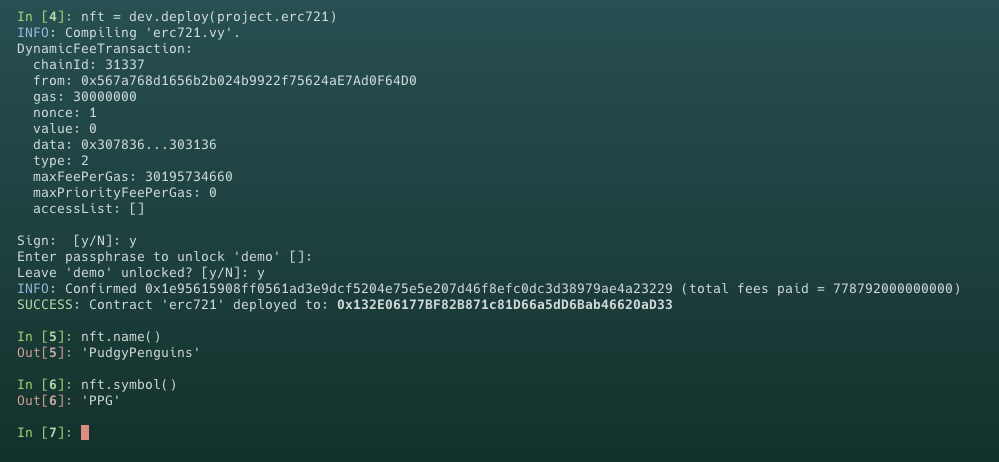

# Vyper 入门: 26. ERC721

本节我们将介绍以太坊中的 `ERC721` 标准，并发行一款 `NFT`

## `ERC721` 与 `ERC165`

接下来简单介绍一下 `ERC721` 和 `ERC165` 的关系，`ERC721` 标准中包含了对 `ERC165` 的支持，要求 `ERC721` 兼容的智能合约必须实现 `supportsInterface` 方法来声明它们支持 `ERC721` 的接口。这意味着任何智能合约或 dApp 都可以通过 `ERC165` 的机制来确认一个合约是否遵循 `ERC721` 标准，从而在执行 `NFT` 相关操作之前确保合约的兼容性和功能性。

### ERC721

`ERC721` 是一个 `Ethereum` 标准，用于创建和管理非同质化代币（Non-Fungible Tokens, NFTs）。这类代币的特点是每个代币都是独一无二的，与其他代币不可互换。`ERC721` 标准定义了一套 API 接口，使得在以太坊网络上的智能合约可以发行、转移和管理这些独特的代币。这使得 `ERC721` 非常适合用于代表独特的数字或现实世界的资产，如数字艺术品、收藏品、房地产或其他任何独一无二的物品。

**主要特性：**

- 非同质性：每个 `NFT` 都有一个独特的标识符 `TokenID`，它与任何其他 `NFT` 不同，确保了每个 `NFT` 的独特性和不可替代性
- 所有权和转移：`ERC721` 标准定义了如何安全地跟踪每个 `NFT` 的所有者，并允许所有者将其 `NFT` 转移给其他用户
- 可互操作性：遵循 ERC-721 标准的智能合约和 NFT 可以在整个以太坊生态系统中被广泛识别和交互，支持各种应用和服务，如市场、展示平台和游戏
- 扩展性：除了基本的所有权和转移功能外，ERC-721 还支持一系列扩展，如 `ERC721Metadata` 元数据（提供关于 NFT 的额外信息）和 `ERC721Enumerable` 可枚举性（允许查询合约中的全部或特定 NFT）

### ERC165

`ERC165` 是另一个 `Ethereum` 标准，它提供了一种机制，使得智能合约能够在链上声明它们支持哪些接口。这使得其他合约在与之交互时能够确认并适应这些功能，提高了智能合约之间的互操作性。

`ERC165`创建一个标准方法`supportsInterface`以发布和检测智能合约实现了哪些接口。该方法接受一个接口 ID（通常是函数选择器）作为参数，并返回一个布尔值，表示合约是否实现了该接口。

```
@view
@external
def supportsInterface(interface_id: bytes4) -> bool:
    return empty(bool)
```

在 `Vyper` 中实现 `supportsInterface` 函数

```
SUPPORTED_INTERFACES: constant(bytes4[4]) = [
    0x01FFC9A7,
    0x80AC58CD,
    0x150b7a02,
    0x5B5E139F,
    0x780E9D63
]

@view
@external
def supportsInterface(_interface_id: bytes4) -> bool:
    return _interface_id in SUPPORTED_INTERFACES
```

从接口中我们可以看到 4 个函数选择器：

- `0x01FFC9A7`: 代表 `ERC165` 的接口 ID
- `0x80AC58CD`: 代表 `ERC721` 的接口 ID
- `0x150b7a02`: 代表 `ERC721Receiver` 的接口 ID
- `0x5B5E139F`: 代表 `ERC721Metadata` 的接口 ID
- `0x780E9D63`: 代表 `ERC721Enumerable` 的接口 ID

当查询的是 `ERC165` 或 `ERC721` 的接口 ID 时返回 `True`，反之返回 `False`。

## 理解 `ERC721` 标准

`ERC721` 标准定义了一组最小的公共接口，一个 `NFT` 代币合约必须实现这些接口和事件，包括：

### 函数接口

- `balanceOf`: 查询地址拥有的 `NFT` 的数量

```
@view
@external
def balanceOf(_owner: address) -> uint256:
```

- `ownerOf` : 查询 `NFT` 的所有者 `(owner)` 地址

```
@view
@external
def ownerOf(_tokenId: uint256) -> address:
```

- `transferFrom`: 普通转账, 将 `NFT` 的所有权从一个地址转移到另一个地址。通常在发送方已获得转移 `NFT` 的批准时使用

```
@payable
@external
def transferFrom(_from: address, _to: address, _tokenId: uint256):
```

- `safeTransferFrom`: 安全转账, 安全地将特定 `NFT` 的所有权从一个地址转移到另一个地址。此函数检查接收方是否是智能合约。如果是，它必须实现一个特定函数 `onERC721Received` 来接受转移。

```
@payable
@external
def safeTransferFrom(
    _from: address,
    _to: address,
    _tokenId: uint256,
    _data: Bytes[1024]=b""
):
```

- `approve`: 授权另一个地址使用你的 NFT。你可以允许另一方代表你转移 `NFT`

```
@payable
@external
def approve(_approved: address, _tokenId: uint256):
```

- `getApproved`: 查询 `NFT` 的批准地址。如果 `NFT` 没有批准地址，此函数将返回空地址

```
@view
@external
def getApproved(_tokenId: uint256) -> address:
```

- `setApprovalForAll`: 授权一个操作者管理你的所有 `NFT` 的权限

```
@external
def setApprovalForAll(_operator: address, _approved: bool):
```

- `isApprovedForAll`: 查询操作者是否被批准管理你的所有的 `NFT`

```
@view
@external
def isApprovedForAll(_owner: address, _operator: address) -> bool:
```

注意 `Vyper` 中只有一个 `safeTransferFrom` 函数，可以在转移 `NFT` 时添加额外的数据参数，额外数据可用于在转移时向接收方传递附加信息。

### 事件接口

- `Transfer(address, address, uint256)`: 记录 `NFT` 转移

```
event Transfer:
    sender: indexed(address)
    receiver: indexed(address)
    tokenId: indexed(uint256)
```

- `Approval`: 记录单个 `NFT` 授权

```
event Approval:
    owner: indexed(address)
    approved: indexed(address)
    tokenId: indexed(uint256)

```

- `ApprovalForAll`: 记录所有 `NFT` 授权

```
event ApprovalForAll:
    owner: indexed(address)
    operator: indexed(address)
    approved: bool
```

## ERC721Receiver

`ERC721Receiver` 是 `Ethereum` 的一个接口，它的主要目的是为了确保智能合约能够安全地接收 `NFT`。当一个 `NFT` 被发送到一个合约时，该合约必须能够正确地处理或拒绝接收 `NFT`。`ERC721Receiver` 接口通过定义一个标准函数 `onERC721Received` 来实现这一点，这个函数会在 `NFT` 被转移到合约时自动调用。

```
interface ERC721Receiver:
    def onERC721Received(
            _operator: address,
            _from: address,
            _tokenId: uint256,
            _data: Bytes[1024]
        ) -> bytes4: nonpayable
```

当 `NFT` 通过 `safeTransferFrom` 函数转移到合约时，`onERC721Received` 函数被调用。该函数的参数包括：

- `operator`: 执行转移操作的地址
- `from`: 代币的前一个所有者的地址
- `tokenId`: 被转移的代币的唯一标识符
- `data`: 附加数据，可以是空的。这允许发送者传递额外的信息给接收者

为了表明合约能够安全接收 `NFT`，`onERC721Received` 函数必须返回一个特定的魔术值

```
method_id("onERC721Received(address,address,uint256,bytes)", output_type=bytes4)
```

这个返回值是预先定义的，等于 `0x150b7a02`

接下来我们看一下如何在 `ERC721` 合约中实现 `onERC721Received` 函数

```
interface ERC721Receiver:
    def onERC721Received(
            _operator: address,
            _from: address,
            _tokenId: uint256,
            _data: Bytes[1024]
        ) -> bytes4: nonpayable


@internal
def _check_on_erc721_received(
    _from: address,
    _to: address,
    _token_id: uint256,
    _data: Bytes[1024]
) -> bool:
    if (_to.is_contract):
        return_value: bytes4 = ERC721Receiver(_to).onERC721Received(msg.sender, _from, _token_id, _data)
        assert return_value == method_id("onERC721Received(address,address,uint256,bytes)", output_type=bytes4)
        return True
    else:
        return True
```

## ERC721Metadata

`ERC721Metadata` 是 `ERC721` 标准的一个可选扩展，旨在为每个 `NFT` 提供富有描述性的元数据。这些元数据包括 `NFT` 的名称、代号和一个代表该 `NFT` 的外部图像

`ERC721Metadata` 接口函数：

- `name`: `NFT` 名称

```
name: public(immutable(String[25]))
```

- `symbol`: `NFT` 代号

```
symbol: public(immutable(String[25]))
```

- `tokenURI`: 返回一个指定 tokenID 的 `URI`，该 `URI` 指向一个包含该 `NFT` 相关信息（如名称、描述、图像等）的 `JSON` 文件。这个 `JSON` 文件通常托管在 `IPFS` 或其他去中心化存储解决方案上

```
@view
@external
def tokenURI(_token_id: uint256) -> String[132]:
    return "ipfs://"
```

## 部署 `ERC721`

接下来我们部署一个 `NFT`，需要查看完整合约代码点击 [点击这里](./erc721.vy)

编译合约并部署



现在我们已经成功部署一个名称为 `PudgyPenguins` 的 `NFT` ，接下来我们需要调用 `mint()` 函数给自己铸造一些代币


可以看到我们成功为自己铸造了 `0` 号 `PudgyPenguins`NFT

打印 `log` 我们已经看到里面包含四个信息


- 事件 `Transfer`
- 铸币地址 `0x0000000000000000000000000000000000000000`
- 接收地址 `0x567a768d1656b2b024b9922f75624aE7Ad0F64D0`
- tokenID `0`

## 总结

本节中，我们介绍了 `ERC721` 标准并部署了一个 `NFT`。需要注意教程中使用的示例代码，仅作教学使用，不适用于生产
