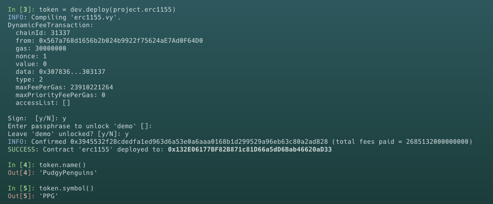
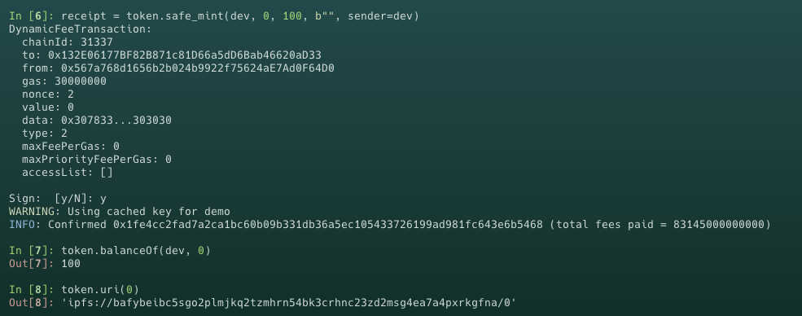
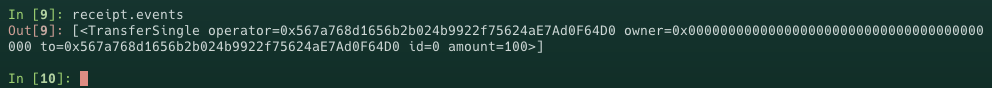
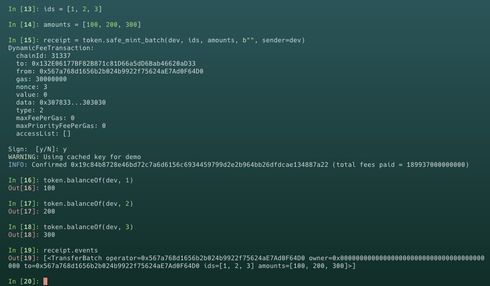

# Vyper 入门: 27. ERC1155

`ERC1155` 是一个 `Ethereum` 的代币标准，由 Enjin 提出，旨在创建一个统一的接口来管理多种代币类型，包括可替代的（如 ERC-20）和不可替代的代币（如 ERC-721）。与 `ERC721` 相比，它允许在单个合约中创建和管理多种代币，减少了交易所需的 `gas` 成本，并提高了批量转移的效率。

`ERC1155` 的大多数使用场景都是在 GameFi 应用中，例如 Decentraland、SandBox、Aavegotchi 等知名链游应用都使用它。假设你想在以太坊上实现一款类似《EVE Online》的链游，使用 `ERC1155` 标准能够极大地优化游戏资产的管理。与其为每艘舰船部署一个独立的合约，不如利用 `ERC1155` 的多代币标准，在一个合约中管理所有的舰船，以及其他各种类型的游戏内物品，如装备、资源和道具等。

## 与 `ERC721` 的区别

- `ERC1155` 支持多种代币类型，而 `ERC721` 仅支持非同质化代币
- 通过批量转移操作，`ERC1155` 可以在一次交易中转移多个代币，降低了交易成本
- `ERC1155` 允许代币之间的无缝转换，增加了使用代币的灵活性

在 `ERC1155` 标准中，代币的同质化或非同质化属性可以通过其发行量来区分。简单地说，如果一个特定 `ID` 的代币发行量限定为 `1`，则该代币被视为非同质化代币，这与 `ERC721` 代币相似，代表每个代币都是独一无二的。相反，如果一个特定 ID 的代币发行量超过 `1`，则这批代币被视为同质化代币，这类似于 `ERC20`，意味着这些代币在功能和价值上是相互可替代的，因为它们共享相同的 ID。这种设计使得 `ERC1155` 能够灵活地支持多种代币类型，无论是 `NFT` 还是 `Token`，都可以在同一个智能合约框架内管理, 并且每种代币都有一个网址 uri 来存储它的元数据，类似 ERC721 的 tokenURI。

## 理解 `ERC1155` 标准

`ERC1155` 标准定义了一组最小的公共接口，一个 `ERC1155` 代币合约必须实现这些接口和事件，包括：

### 函数接口

- `balanceOf`: 查询账户拥有的特定代币的数量

```
balanceOf: public(HashMap[address, HashMap[uint256, uint256]])
```

- `balanceOfBatch`: 批量查询多个账户的多种代币的余额

```
@view
@external
def balanceOfBatch(accounts: DynArray[address, BATCH_SIZE], ids: DynArray[uint256, BATCH_SIZE]) -> DynArray[uint256,BATCH_SIZE]:
```

- `safeTransferFrom`: 安全转账，如果 `to` 地址是合约，则会验证是否实现了` onERC1155Received` 接收函数

```
@external
def safeTransferFrom(
    _sender: address,
    _receiver: address,
    _id: uint256,
    _amount: uint256,
    _bytes: bytes32
):
```

- `safeBatchTransferFrom`: 批量安全转账，如果 `to` 地址是合约，则会验证是否实现了` onERC1155BatchReceived` 接收函数

```
@external
def safeBatchTransferFrom(
    _sender: address,
    _receiver: address,
    _ids: DynArray[uint256, BATCH_SIZE],
    _amounts: DynArray[uint256, BATCH_SIZE],
    _bytes: bytes32
):
```

- `setApprovalForAll`: 授权一个操作者管理你的所有 `ERC1155` 代币的权限

```
@external
def setApprovalForAll(
    _owner: address,
    _operator: address,
    _approved: bool
):
```

- `isApprovedForAll`: 查询操作者是否被批准管理你的所有的 `ERC1155` 代币

```
isApprovedForAll: public( HashMap[address, HashMap[address, bool]])
```

### 事件接口

- `TransferSingle`: 记录单个代币转账

```
event TransferSingle:
    operator:   indexed(address)
    fromAddress: indexed(address)
    to: indexed(address)
    id: uint256
    value: uint256

```

- `TransferBatch`: 记录多个代币转账

```
event TransferBatch:
    operator: indexed(address)
    fromAddress: indexed(address)
    to: indexed(address)
    ids: DynArray[uint256, BATCH_SIZE]
    values: DynArray[uint256, BATCH_SIZE]
```

- `ApprovalForAll`: 记录代币授权/取消授权

```
event ApprovalForAll:
    account: indexed(address)
    operator: indexed(address)
    approved: bool
```

- `URI`: 记录代币的 `URI` 变化

```
event URI:
    value: String[MAX_URI_LENGTH]
    id: indexed(uint256)
```

### ERC1155Receiver

`ERC1155Receiver` 是一种接口，专为处理 `ERC1155` 代币的接收而设计。它允许智能合约安全地接收 `ERC1155` 代币，无论是单个代币还是批量代币。这个接口确保了在代币被转移到合约地址时，合约能够正确响应并处理这些代币，避免了代币被错误发送到合约中而无法恢复的风险。

当 `ERC1155` 通过 `safeTransferFrom` 函数单个转移到合约时，`onERC1155Received` 函数被调用。该函数的参数包括：

- `operator`: 执行转移操作的地址
- `sender`: 代币发送者的地址
- `id`: 被转移的代币的 ID
- `amount`: 被转移的代币的数量
- `data`: 与转移一起发送的额外数据

此方法在成功处理接收的代币后，必须返回

```
method_id("onERC1155Received(address,address,uint256,uint256,bytes)", output_type=bytes4)
```

以表明接收成功，这个返回值是 `0xf23a6e61`

当 `ERC1155` 通过 `safeBatchTransferFrom` 函数批量转移到合约时，`onERC1155BatchReceived` 函数被调用。该函数的参数包括：

- `operator`: 执行转移操作的地址
- `sender`: 代币发送者的地址
- `ids`: 被转移的代币的 ID 列表
- `amounts`: 对应于 `ids` 中每个代币 `ID` 的被转移代币的数量列表
- `data`: 与转移一起发送的额外数据

此方法在成功处理接收的代币后，必须返回

```
method_id("onERC1155BatchReceived(address,address,uint256[],uint256[],bytes)", output_type=bytes4)
```

以表明接收成功，这个返回值是 `0xbc197c81`

接下来我们看一下如何在 `ERC1155` 合约中实现 `onERC1155Received` 和 `onERC1155BatchReceived` 函数:

```
interface IERC1155Receiver:
    def onERC1155Received(
       operator: address,
       sender: address,
       id: uint256,
       amount: uint256,
       data: Bytes[CALLBACK_NUMBYTES],
   ) -> bytes4: payable
    def onERC1155BatchReceived(
        operator: address,
        sender: address,
        ids: DynArray[uint256, BATCH_SIZE],
        amounts: DynArray[uint256, BATCH_SIZE],
        data: Bytes[CALLBACK_NUMBYTES],
    ) -> bytes4: payable


@internal
def _check_on_erc1155_received(
    owner: address,
    to: address,
    id: uint256,
    amount: uint256,
    data: Bytes[1024]
) -> bool:
    if (to.is_contract):
        return_value: bytes4 = IERC1155Receiver(to).onERC1155Received(msg.sender, owner, id, amount, data)
        assert return_value == method_id("onERC1155Received(address,address,uint256,uint256,bytes)", output_type=bytes4)
        return True
    else:
        return True


@internal
def _check_on_erc1155_batch_received(
    owner: address,
    to: address,
    ids: DynArray[uint256, _BATCH_SIZE],
    amounts: DynArray[uint256, _BATCH_SIZE],
    data: Bytes[1024]
) -> bool:
    if (to.is_contract):
        return_value: bytes4 = IERC1155Receiver(to).onERC1155BatchReceived(msg.sender, owner, ids, amounts, data)
        assert return_value == method_id("onERC1155BatchReceived(address,address,uint256[],uint256[],bytes)", output_type=bytes4)
        return True
    else:
        return True
```

### ERC1155MetadataURI

ERC1155MetadataURI 是 ERC1155 标准的一个可选扩展接口，是 ERC1155 标准的一部分, 它定义了一个名为 uri 的函数，接受一个 token ID 作为参数，并返回该 token 的 URI。这样，你的合约就可以通过 uri 函数提供 token 的元数据 URI，这个 URI 可以是一个指向 JSON 文件的链接，该文件包含了 token 的元数据, 这些元数据通常包括 token 的名称、描述、图像等信息。

```
interface IERC1155MetadataURI:
    def uri(id: uint256) -> String[MAX_URI_LENGTH]: view

```

## 部署 `ERC1155`

接下来我们部署一个 `ERC1155` 代币，需要查看完整合约代码点击 [点击这里](./erc1155.vy)

**编译合约并部署**



现在我们已经成功部署一个名称为 `PudgyPenguins` 的 `ERC1155` 代币 ，接下来我们需要调用 `safe_mint()` 函数给自己铸造一些代币



可以看到我们成功为自己铸造了 `100` 个 `0` 号 `PudgyPenguins` 代币

打印 `log` 我们已经看到里面包含 6 个信息



- 事件 `TransferSingle`
- 操作者 `0x567a768d1656b2b024b9922f75624aE7Ad0F64D0`
- 铸币地址 `0x0000000000000000000000000000000000000000`
- 接收地址 `0x567a768d1656b2b024b9922f75624aE7Ad0F64D0`
- tokenID `0`
- 数量 `100`

接下来我们尝试批量铸造 `1`、`2`、`3`号代币数量分别为 `100`、`200`、`300`，批量铸造单个铸造类似


## 总结

本节中，我们介绍了 `ERC1155` 标准并部署了一个代币。需要注意教程中使用的示例代码，仅作教学使用，不适用于生产
