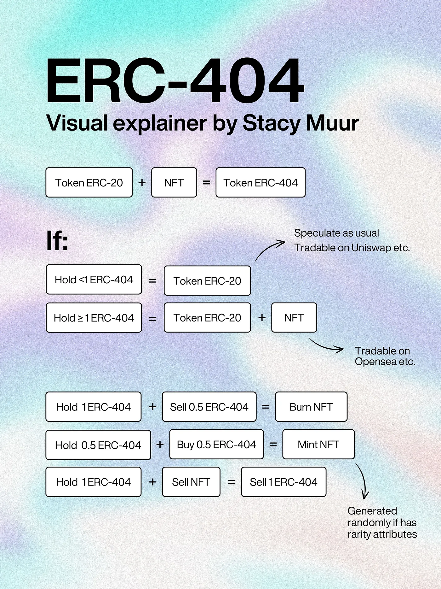
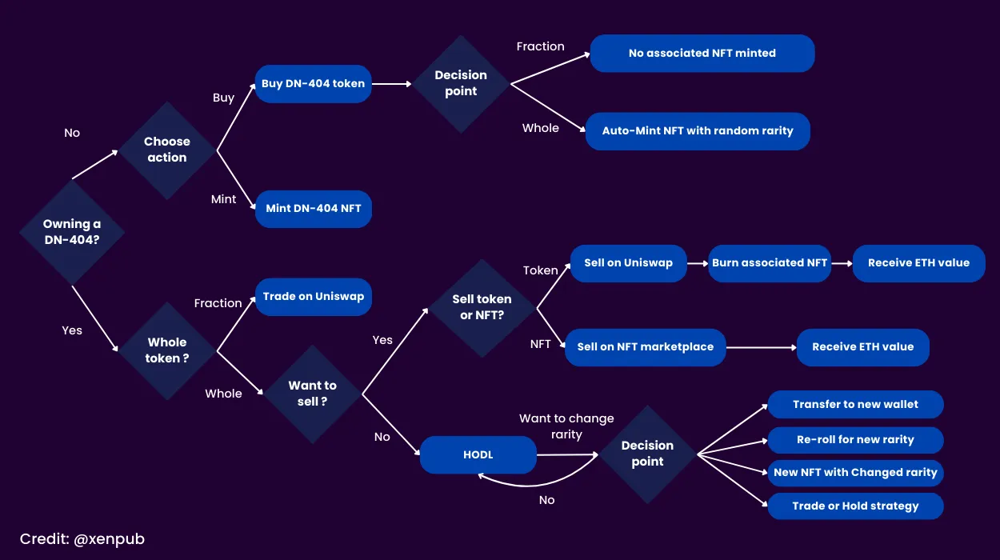
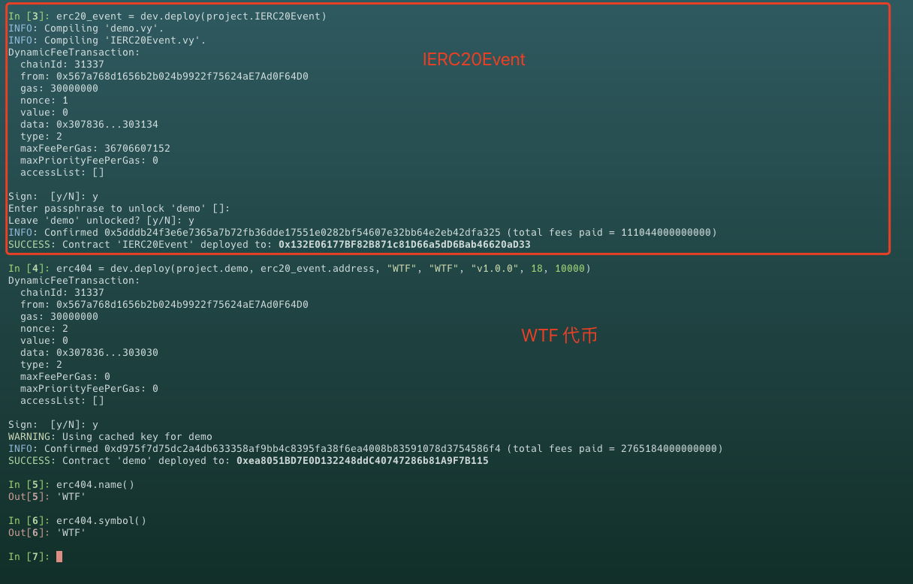
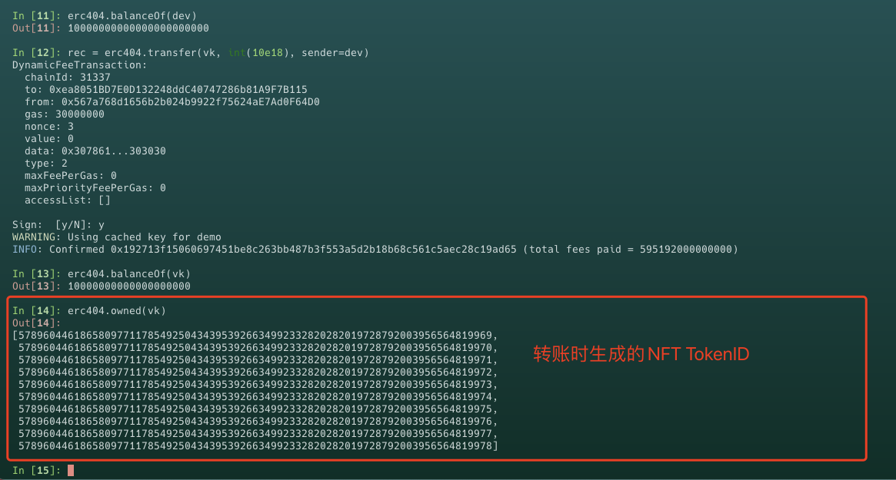
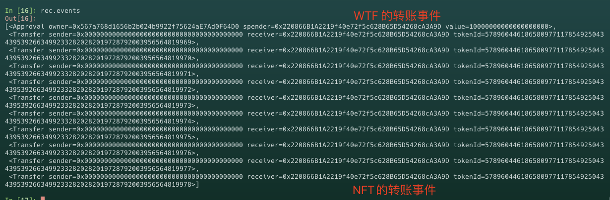

# Vyper 入门: 28. TOKEN404
`TOKEN404` 代币标准是一种实验性以太坊代币新玩法，旨在将可替代代币 `ERC20` 和不可替代代币 `ERC721` 的特征合并为混合形式，从而允许在区块链上实现唯一且可分割的资产表示。


## `TOKEN404` 
`TOKEN404` 是一种尝试性的代币标准，它巧妙地结合了 `ERC20` 代币和 `ERC-721` 代币的特性。这种创新让我们能够拥有单个NFT的一部分。

简而言之，`TOKEN404` 试图为数字资产带来更多的灵活性和流动性，但是这个标准还是非官方的、处于实验阶段。

### 优点
和 `ERC721` 相比，`TOKEN404` 有几个明显的优点:
- `增加流动性`: 这一创新让 `NFT` 的买卖不仅限于传统的 `NFT` 市场，还能在去中心化交易所进行，大大提升了买家和卖家的可获取性。但这也意味着，项目方需要额外建立一个流动性池，并发行自己的加密货币来配合 `NFT` 系列的发布

- `部分所有权`: 你可以拥有一个 `NFT` 的一部分，这让 `NFT` 变得更加平易近人，让更多的人能够负担得起并参与进来

- `动态稀缺性`: `NFTs` 成为了一种“生动”的资产，它们的产生和消失取决于交易活动和钱包间的互相转移，这种方式营造了一种动态的稀有性和吸引力


### 机制
接下来我们了解下它的运作原理

假设我们部署了一个 `TOKEN404` 代币，其中包含 `10000` 个 `WTF` 代币和相对应的 `10000` 个镜像 `WTFNFT`

当我们在 `Uniswap` 上购买 `WTF` 代币会发生什么？我们从 `TOKEN404` 流程图中查看

(图来自网络)


从图中我们可以看到，如果我在 `Uniswap` 上购买 1个 `WTF`，我会收到 1个 `WTF` 代币和 1个 `WTFNFT`，如果购买数量少于1个 `WTF`，那么不会收到 `WTFNFT`，只有购买整数代币时才会收到 `NFT`，收到的 `NFT` 由合约自动完成的，因此是随机的并且具有稀有度。

如果你卖出 1个 `WTF`代币，那么对应的 1个 `WTFNFT`将会被燃烧。
如果觉得这张图讲的不够完整，可以看下面这张更完整的流程图:




接下来我们将实现一个 `TOKEN404` 合约并部署它

## `TOKEN404` 实现
与 `ERC721` 相同，`TOKEN404` 也需要实现 `ERC165` 接口:
```
from vyper.interfaces import ERC165
implements: ERC165

SUPPORTED_INTERFACES: constant(bytes4[2]) = [
    0x01ffc9a7, # ERC165
    0xcaf91ff5 # TOKEN404
]

@view
@external
def supportsInterface(_interface_id: bytes4) -> bool:
    return _interface_id in SUPPORTED_INTERFACES
```

### `TOKEN404` 接口合约
由于 `TOKEN404` 标准相对较新，尚未经过正式审核，所有合约接口可能会在未来进行修改。`TOKEN404` 接口实现了 `ERC20` 和 `ERC721` 的所有接口，所以本节中我们将介绍 `TOKEN404` 独有的接口

- `erc20TotalSupply`: 查询 `ERC20` 代币总供应量
```
@view
@external
def erc20TotalSupply() -> uint256:
    return empty(uint256)
```

- `erc721TotalSupply`: 查询 `NFT` 总供应量
```
@view
@external
def erc721TotalSupply() -> uint256:
    return empty(uint256)
```

- `erc721BalanceOf`: 查询地址拥有的 `NFT` 余额
```
@view
@external
def erc721BalanceOf(_owner: address) -> uint256:
    return empty(uint256)
```

- `erc20BalanceOf`: 查询地址拥有的 `ERC20` 代币余额
```
@view
@external
def erc20BalanceOf(_owner: address) -> uint256:
    return empty(uint256)
```

- `erc721TransferExempt`: 查询在 `ERC20` 代币转移时免除 `NFT` 转移的白名单地址，一般用于 `Dex` 交易对地址或 `Dex` 路由地址，节省 `gas` 费用
```
@view
@external
def erc721TransferExempt(_target: address) -> bool:
    return empty(bool)
```

- `owned`: 查询地址拥有的 `NFT` 列表
```
@view
@external
def owned(_owner: address) -> DynArray[uint256, max_value(uint8)]:
    return empty(DynArray[uint256, max_value(uint8)])
```

- `getERC721QueueLength`: 查询 `NFT` 双端队列的长度
```
@view
@external
def getERC721QueueLength() -> uint256:
    return empty(uint256)
```

- `getERC721TokensInQueue`: 查询队列中从指定起始位置开始的一定数量的 `NFT` `TokenID`，并将这些 `TokenID` 以列表的形式返回。
```
@view
@external
def getERC721TokensInQueue(_start: uint256, _count: uint256) -> DynArray[uint256, max_value(uint8)]:
    return empty(DynArray[uint256, max_value(uint8)])
```

- `setSelfERC721TransferExempt`: 设置 `NFT` 转移白名单地址
```
@external
def setSelfERC721TransferExempt(_target: address, _state: bool):
    pass
```

### `TOKEN404` 事件接口
由于 `Vyper` 中无法导入外部合约文件的函数，为了避免 `ERC20` 和 `ERC721` 事件命名冲突，我们需要先部署一个 `IERC20Event` 合约。`0.4` 版本开始可能会支持从导入外部合约文件，导入代码示例:
```
# demo.vy

@view
@internal
def number_a() -> uint256:
    return block.number + 1

# main.vy

import demo as dm

@view
@external
def get_number() -> uint256:
    return dm.number_a()
```

`IERC20Event` 代码示例:
```
# pragma version 0.3.10

event Approval:
    owner: indexed(address)
    spender: indexed(address)
    value: uint256

event Transfer:
    sender: indexed(address)
    receiver: indexed(address)
    value: uint256


@external
def approve_event(_owner: address, _spender: address, _value: uint256) -> bool:
    log Approval(_owner, _spender, _value)
    return True


@external
def transfer_event(_sender: address, _receiver: address, _value: uint256) -> bool:
    log Approval(_sender, _receiver, _value)
    return True
```

- `approve_event`: 用于处理 `ERC20` 授权事件
- `transfer_event`: 用于处理 `ERC20` 转移事件


## ERC721Receiver

和 `ERC721` 一样，`TOKEN404` 同样需要实现 `onERC721Received` 函数用于处理 `NFT` 接受者是合约的情况 

```
interface ERC721Receiver:
    def onERC721Received(
            _operator: address,
            _from: address,
            _tokenId: uint256,
            _data: Bytes[1024]
        ) -> bytes4: nonpayable
```

## `TOKEN404` 转帐逻辑
接下来我们介绍 `TOKEN404` 中实现 `ERC20` 和 `ERC721` 的转帐逻辑，结合了一种特殊的机制来处理 `ERC20` 和 `ERC721` 的互动

### `ERC20` 转账逻辑 
`_transfer_erc20`

这个内部方法处理 `ERC20` 代币从一个地址到另一个地址的转移。如果发送者地址为空，则会增加总供应量；否则，会从发送者的余额中扣除相应的令牌数量，并增加接收者的余额。此过程确保了令牌的总供应量在必要时得以调整。

```
@internal
def _transfer_erc20(_from: address, _to: address, _value: uint256):
    if _from == empty(address):
        self.totalSupply += _value
    else:
        self.balanceOf[_from] -= _value

    self.balanceOf[_to] += _value
    assert IERC20Event(EVENT20).transfer_event(_from, _to, _value)
```

### `ERC721` 转账逻辑 
`_transfer_erc721`

这个内部方法处理单个 `NFT`从一个地址转移到另一个地址。如果存在从地址，则移除相关的授权并调整所有权数据结构；如果存在至地址，则更新 `NFT` 的所有者并记录 `NFT` 的新位置
```
@internal
def _transfer_erc721(_from: address, _to: address, _id: uint256):
    if _from != empty(address):
        self.id_to_approvals[_id] = empty(address)
        last_id: uint256 = self._owned[_from][len(self._owned[_from]) - 1]

        if last_id != _id:
            last_index: uint256 = self._get_owned_index(_id)
            self._owned[_from][last_index] = last_id
            self._set_owned_index(last_id, last_index)

        self._owned[_from].pop()

    if _to != empty(address):
        self._set_owner_of(_id, _to)
        self._owned[_to].append(_id)
        self._set_owned_index(_id, len(self._owned[_to]) - 1)
    else:
        self._owned_data[_id] = empty(uint256)

    log Transfer(_from, _to, _id)
```


### 综合 `ERC20` 和 `ERC721` 的转账逻辑
`_transfer_erc20_with_erc721`

这个方法是合约的核心，它结合了 `ERC20` 和 `ERC721` 的转帐逻辑。根据转移方和接收方是否免除 `ERC721` 转移，此方法可能会触发 `ERC721` 的铸造、查询或存储逻辑，以保持 `ERC20` 和 `ERC721` 间的一致性。

- 如果双方都免除，则不发生 `ERC721` 转账操作
- 如果仅接收方免除，则可能会为接收方铸造或查询 `NFT` 
- 如果仅发送方免除，则可能会从发送方取回并查询 `NFT` 
- 如果双方都未免除，则会根据 `ERC20` 代币的转移量直接转移相应数量的 `NFT` 

```
@internal
def _transfer_erc20_with_erc721(_from: address, _to: address, _value: uint256) -> bool:
    erc20_balance_of_sender_before: uint256 = self.balanceOf[_from]
    erc20_balance_of_receiver_before: uint256 = self.balanceOf[_to]
    self._transfer_erc20(_from, _to, _value)

    is_from_erc721_exempt: bool = self._erc721_transfer_exempt[_from]
    is_to_erc721_exempt: bool = self._erc721_transfer_exempt[_to]

    uts: uint256 = self.units

    if is_from_erc721_exempt and is_to_erc721_exempt:
        pass 

    elif is_from_erc721_exempt:
        tokens_to_retrieve_or_mint: uint256 = (self.balanceOf[_to] / uts) - (erc20_balance_of_receiver_before / uts)

        for i in range(255):
            if i >= tokens_to_retrieve_or_mint:
                break
            self._retrieve_or_mint_erc721(_to)

    elif is_to_erc721_exempt:
        tokens_to_withdraw_and_store: uint256 = (erc20_balance_of_sender_before / uts) - (self.balanceOf[_from] / uts)

        for i in range(255):
            if i >= tokens_to_withdraw_and_store:
                break
            self._withdraw_and_store_erc721(_from)

    else:
        nfts_to_transfer: uint256 = _value / uts

        for i in range(255):
            if i >= nfts_to_transfer:
                break
            
            index_of_last_token: uint256 = len(self._owned[_from]) - 1
            token_id: uint256 = self._owned[_from][index_of_last_token]
            self._transfer_erc721(_from, _to, token_id)

        if ((erc20_balance_of_sender_before / uts) - (self.balanceOf[_from] / uts)) > nfts_to_transfer:
            self._withdraw_and_store_erc721(_from)

        if ((self.balanceOf[_to] / uts) - (erc20_balance_of_receiver_before / uts)) > nfts_to_transfer:
            self._retrieve_or_mint_erc721(_to)

    return True
```

以上是合约的核心转移逻辑部分，需要查看完整合约代码点击 [点击这里](./erc404.vy)


## `TOKEN404` 部署

接下来我们编译部署一个 `TOKEN404` 代币
1. 部署 `IERC20Event` 
2. 部署一个名为 `WTF` 的 `TOKEN404` 合约，初始供应量为 `10000`



3. 给 `V神` 转账并查询余额


4. 查看 `log` 可以看到 `WTF` 和 `NFT` 的转账事件



## 总结
本节中我们介绍了 `TOKEN404` 标准，ERC-404是一个较新的标准，它旨在为ERC-20和ERC-721代币提供一种统一的转账和处理逻辑。本节中使用的 `Vyper` 合约还未进行审核并有很多需要调整的地方，请不要直接使用在生产中。